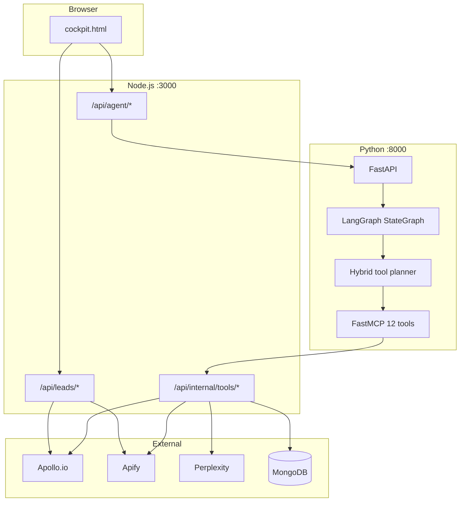

# Outbound Cockpit

**Agentic founder-led outreach** — a LangGraph + FastMCP sales research system that replaces single-shot LLM calls with tool-calling agents, live web research, and consultative draft generation.


[](https://outbound-cockpit-xopw.onrender.com/cockpit.html)

**Live app:** [outbound-cockpit-xopw.onrender.com/cockpit.html](https://outbound-cockpit-xopw.onrender.com/cockpit.html) · **GitHub:** [nancyjain779/outbound-cockpit](https://github.com/nancyjain779/outbound-cockpit)

> **Public demo — no login required.** Visitors open the link above with no password.  
> `COCKPIT_SERVICE_TOKEN` is a **server-only secret** (set in Render env) — never put it in the README, GitHub, or share it with users.

**Recruiter demo:** pick a prospect → **Analyse** → watch the **Agent trace** panel. Guide: [docs/DEMO.md](docs/DEMO.md)

---

## Live deployment (Render)

Two-service Blueprint from [`render.yaml`](render.yaml):

| Service | URL | Role |
|---------|-----|------|
| **outbound-cockpit** | https://outbound-cockpit-xopw.onrender.com | Public UI + tool bridge |
| **outreach-agent** | https://outreach-agent-nuuh.onrender.com | LangGraph agent + MCP (backend) |

**Env wiring** (Blueprint sets URLs automatically; verify if agent trace is missing):

| Service | Variable | Value |
|---------|----------|--------|
| Node | `AGENT_SERVICE_URL` | `https://outreach-agent-nuuh.onrender.com` |
| Python | `NODE_TOOL_BRIDGE_URL` | `https://outbound-cockpit-xopw.onrender.com` |
| **Both** | `COCKPIT_SERVICE_TOKEN` | Same secret (not a URL) |
| **Both** | `OPENAI_API_KEY` | `sk-...` — no separate LiteLLM key |

Health checks: [Node `/healthz`](https://outbound-cockpit-xopw.onrender.com/healthz) · [Python `/health`](https://outreach-agent-nuuh.onrender.com/health) (expect `bridge_ok: true`)

---

## Overview

Outbound Cockpit helps operators research prospects, classify social signals, and draft human-sounding opening messages — without sounding like sales spam. A **Node.js** UI and lead-sourcing API sits in front of a **Python LangGraph agent** that orchestrates **12 MCP tools** (Apollo, Apify, Perplexity, MongoDB CRM).

| Layer | Tech | Role |
|-------|------|------|
| UI | `cockpit.html` | Daily outreach workflow — leads, analyse, drafts |
| API gateway | Node.js | Auth, rate limits, agent proxy, internal tool bridge |
| Agent | LangGraph + FastAPI | Plan → gather → synthesize → validate → persist |
| Tools | FastMCP → Node bridge | Apollo, Apify, Perplexity, CRM |

---

## Screenshots

| Leads pipeline | AI analyse + agent trace |
|----------------|--------------------------|
|  |  |

> Replace SVG previews with live PNGs — see [docs/screenshots/README.md](docs/screenshots/README.md).  
> **Try the live app:** [outbound-cockpit-xopw.onrender.com/cockpit.html](https://outbound-cockpit-xopw.onrender.com/cockpit.html)

---

## Architecture



Full diagrams, graph nodes, and SSE streaming: **[docs/ARCHITECTURE.md](docs/ARCHITECTURE.md)**

---

## Features

- **LangGraph agent** — hybrid tool planner (rules + LLM), one-tool-per-step execution loop, LLM-as-judge validation with bounded retries
- **12 MCP tools** — classify, enrich, scrape, LinkedIn profile, web research, CRM read/write, validate
- **SSE streaming** — live agent trace in the UI (`plan` → `tool` → `synthesize` → `validate` → `final`)
- **Multi-turn chat** — MongoDB thread memory for “revise draft” without re-running full research
- **Lead sourcing** — Apollo people search, Apify LinkedIn posts, Reddit intent finder
- **Graceful degradation** — works without API keys (heuristic mode); `AGENT_FALLBACK=1` falls back to legacy `/api/ai/*`

---

## Quick start (local)

```bash
git clone https://github.com/nancyjain779/outbound-cockpit.git
cd outbound-cockpit
cp .env.example .env          # add keys (see below)
npm install && npm run dev      # Terminal 1 — http://localhost:3000/cockpit.html
```

```bash
# Terminal 2 — Python agent
cd outreach-agent
pip install -e .
export NODE_TOOL_BRIDGE_URL=http://localhost:3000
export COCKPIT_SERVICE_TOKEN=dev-secret
export OPENAI_API_KEY=sk-...
uvicorn agent.api.main:app --reload --port 8000
```

**Minimum env vars for full agent flow:**

| Variable | Purpose |
|----------|---------|
| `COCKPIT_SERVICE_TOKEN` | Shared secret between Node ↔ Python (Render env only — **never public**) |
| `OPENAI_API_KEY` or `PERPLEXITY_API_KEY` | LLM + web research |
| `AGENT_SERVICE_URL` | Node → Python (default `http://localhost:8000`) |

Optional: `APOLLO_API_KEY`, `APIFY_TOKEN`, `MONGODB_URI`, `REDDIT_*` — see [.env.example](.env.example).

---

## Docker

```bash
cp .env.example .env
# Set COCKPIT_SERVICE_TOKEN and at least one LLM key in .env
docker compose up --build
```

| Service | Port | Image |
|---------|------|-------|
| `cockpit` | 3000 | `Dockerfile.node` |
| `agent` | 8000 | `outreach-agent/Dockerfile` |

Open **http://localhost:3000/cockpit.html**

```bash
docker compose ps          # health status
docker compose logs -f agent
curl http://localhost:8000/health
curl http://localhost:3000/healthz
```

---

## API documentation

| Surface | Base path | Docs |
|---------|-----------|------|
| Browser / public | `/api/leads/*`, `/api/agent/*`, `/api/cockpit` | [docs/API.md](docs/API.md) |
| Python agent | `/v1/*` on port 8000 | [docs/API.md#python-agent-fastapi](docs/API.md#python-agent-fastapi) |
| Internal bridge | `/api/internal/tools/*` (service token) | [docs/API.md#internal-tool-bridge](docs/API.md#internal-tool-bridge) |

Interactive OpenAPI (when agent is running): **http://localhost:8000/docs**

---

## Folder structure

```
outbound-cockpit/
├── public/                 # Single-page UI (cockpit.html)
├── api/
│   ├── agent/              # Proxies to Python agent (+ SSE stream)
│   ├── ai/                 # Legacy monolithic analyse/classify (fallback)
│   ├── leads/              # Apollo, Apify, Reddit lead sourcing
│   ├── cockpit.js          # Mongo sync for prospects
│   └── internal/tools/     # Secured bridge for MCP tool execution
├── lib/                    # Shared Node utilities (mongo, openers, auth)
├── outreach-agent/
│   ├── agent/              # LangGraph graph, nodes, planner, prompts
│   ├── mcp_server/         # FastMCP tool definitions
│   ├── memory/             # MongoDB thread store
│   ├── eval/               # Golden-set eval scaffold
│   └── tests/
├── docs/                   # Architecture, API, design, deploy guides
├── docker-compose.yml
├── Dockerfile.node
├── render.yaml             # Render.com two-service deploy
└── server.js               # Node HTTP server + auth gate
```

Details: **[docs/FOLDER_STRUCTURE.md](docs/FOLDER_STRUCTURE.md)**

---

## Design decisions

Key choices (LangGraph vs Temporal, Node+Python split, hybrid planner, SSE, fallback path): **[docs/DESIGN.md](docs/DESIGN.md)**

---

## Future improvements

Roadmap (eval metrics, Slack bot, batch jobs, Temporal if needed): **[docs/FUTURE.md](docs/FUTURE.md)**

---

## Deploy to production

Step-by-step **Render Blueprint** guide: **[docs/DEPLOY.md](docs/DEPLOY.md)**  
**Recruiter live demo script:** **[docs/DEMO.md](docs/DEMO.md)**

---

## Eval

```bash
cd outreach-agent && python -m eval.run_eval
```

Golden set: `outreach-agent/eval/golden_set.json`

---

## License

MIT — see [LICENSE](LICENSE)
