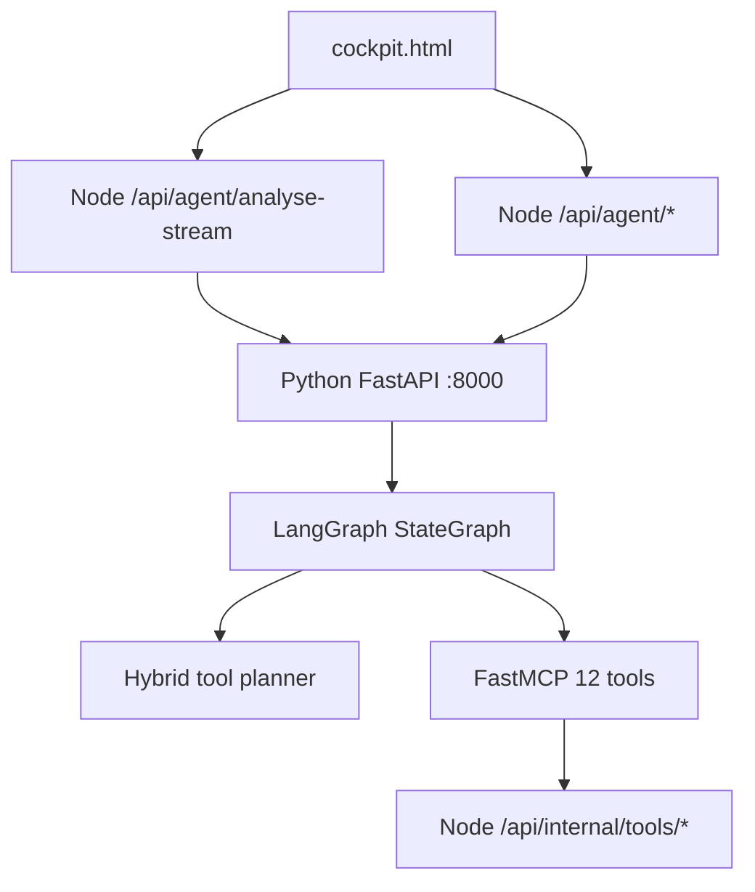
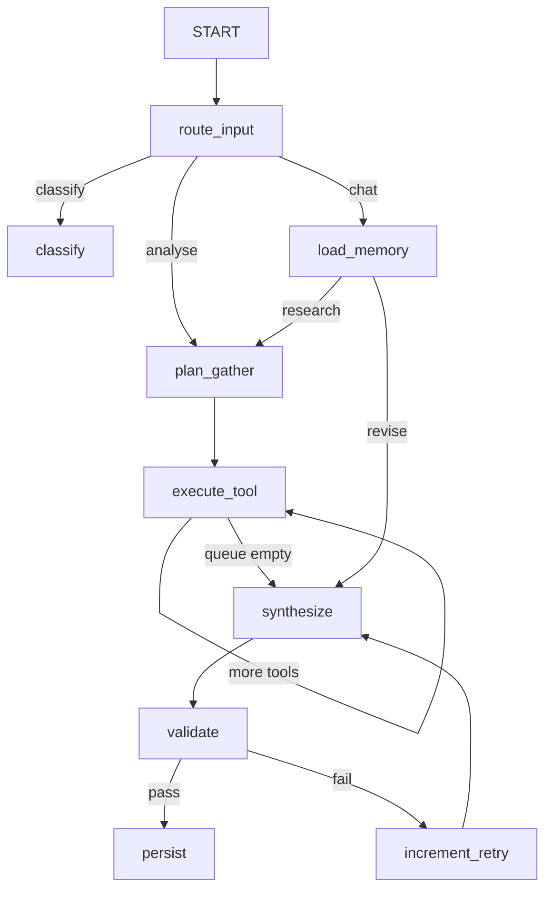

# Outbound Cockpit — Architecture

> See also: [API](API.md) · [Design decisions](DESIGN.md) · [Folder structure](FOLDER_STRUCTURE.md) · [Deploy](DEPLOY.md)

## System diagram

## LangGraph nodes (A3)

| Node | Role |
|------|------|
| `route_input` | analyse / classify / chat |
| `plan_gather` | Hybrid planner: rules eligibility + LLM order/trim |
| `execute_tool` | Runs **one** tool per visit (loop until queue empty) |
| `synthesize` | LLM brief + draft message |
| `validate` | LLM-as-judge (MESSAGE_DONTS) |
| `increment_retry` | Retry up to 2x on validation fail |
| `persist` | Save brief to Mongo via bridge |
| `classify` | Track triage from pasted text |
| `load_memory` | Load thread by prospect_id |
| `chat_reply` | Multi-turn revision |

## Hybrid planner

1. **Rules layer** ([`agent/tool_catalog.py`](outreach-agent/agent/tool_catalog.py)) — determines eligible tools (skip enrich if `companyFacts` cached, etc.)
2. **LLM layer** ([`agent/planner.py`](outreach-agent/agent/planner.py)) — orders/trims eligible tools; falls back to rules-only if LLM unavailable
3. **Cap** — `MAX_TOOLS_PER_RUN` (default 8)

## SSE streaming (A4)

| Endpoint | Purpose |
|----------|---------|
| `POST /v1/analyse/stream` | Python SSE: plan → tool → synthesize → validate → final |
| `POST /api/agent/analyse-stream` | Node proxy pipes SSE to browser |

Event types: `plan`, `tool`, `synthesize`, `validate`, `retry`, `persist`, `final`, `error`

Non-streaming `POST /v1/analyse` retained for backward compatibility and fallback.

## Internal tool bridge

Secured with `x-service-token: COCKPIT_SERVICE_TOKEN`. Routes under `/api/internal/tools/`.

## Memory

Collection `agent_threads`: keyed by `thread_id` (= prospect.id).

## Security

- Service token for internal + bridge calls
- Agent proxy rate limit: 10 req/min/IP
- Max validation retries: 2

## Agents vs Temporal

| | Outbound Cockpit (this repo) | Temporal (e.g. AI-QA backend) |
|---|---|---|
| **Use case** | Interactive prospect research + draft (30–120s) | Long-running CI/test workflows, hours/days |
| **Orchestration** | LangGraph StateGraph + MCP tools | Durable workflow engine with activity retries |
| **State** | MongoDB thread memory + in-request graph state | Workflow history survives process crashes |
| **When to add Temporal** | Batch jobs, scheduled sequences, enterprise SLA | Already needed for that class of problem |

For founder-led outbound in a browser UI, LangGraph agents are the right fit. Temporal would be additive infrastructure, not a replacement for the agent layer.
